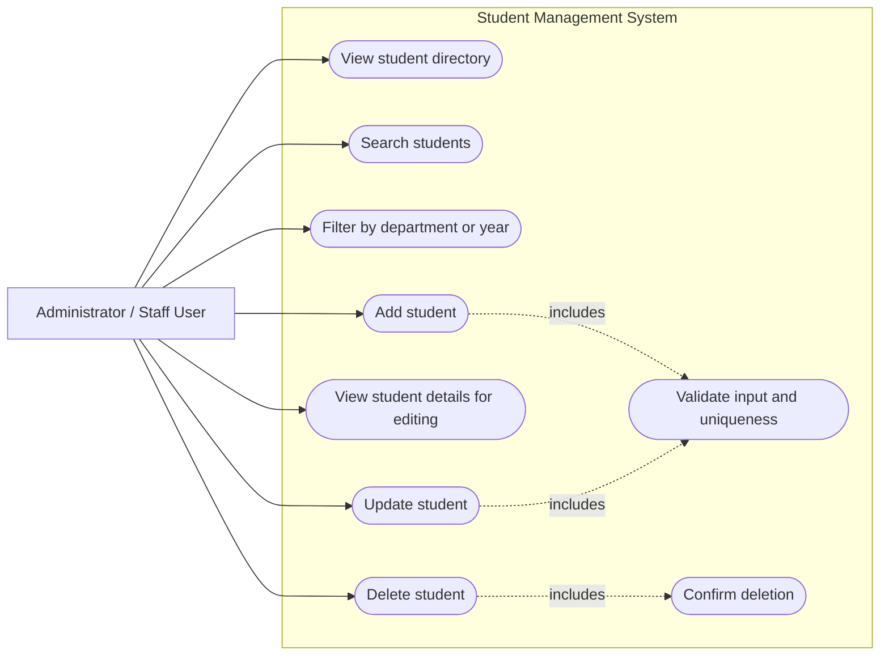
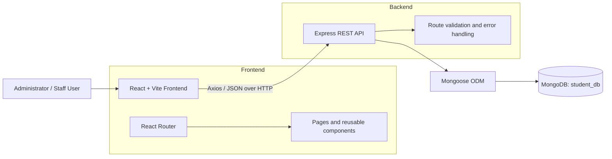
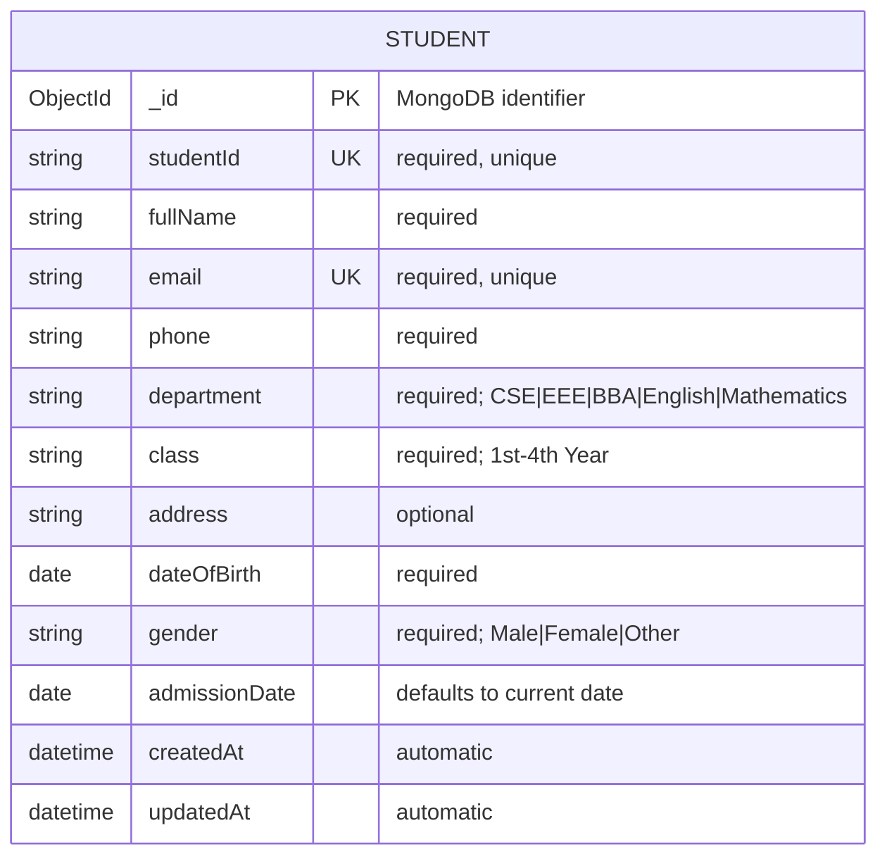
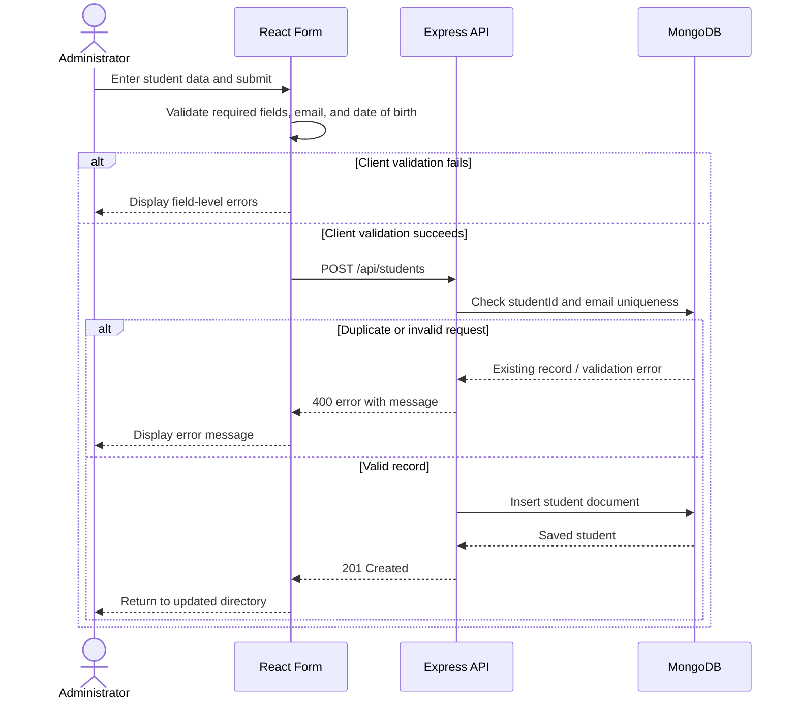

# Student Management System — Project Report

## 1. Project Overview

The Student Management System is a web application for maintaining university student records. An administrator can create, view, search, filter, edit, and delete student profiles through a responsive React interface. The system exposes a REST API built with Express and stores persistent data in MongoDB.

## 2. Objectives

- Replace manual student-record handling with a central digital register.
- Support complete and reliable student-record management.
- Make records easy to find by student ID, name, department, or academic year.
- Prevent invalid, incomplete, and duplicate data from being stored.
- Provide clear feedback for loading, success, failure, and deletion actions.

## 3. Scope and Actors

The current implementation has one external actor: **Administrator / Staff User**. Authentication and separate student accounts are not part of the present system.

| Actor | Responsibilities |
| --- | --- |
| Administrator / Staff User | Maintains student records, searches the directory, filters results, and confirms deletions. |
| Student Management System | Validates requests, applies business rules, and returns records or error messages. |
| MongoDB | Persists student documents and enforces unique indexed fields. |

## 4. Functional Requirements

| ID | Requirement |
| --- | --- |
| FR-01 | The system shall display the student directory. |
| FR-02 | The system shall allow search by full name or student ID. |
| FR-03 | The system shall filter students by department and academic year. |
| FR-04 | The system shall create a student profile with required information. |
| FR-05 | The system shall display an existing profile for editing. |
| FR-06 | The system shall update an existing student profile. |
| FR-07 | The system shall request confirmation before deleting a profile. |
| FR-08 | The system shall reject duplicate student IDs and email addresses. |
| FR-09 | The system shall validate required fields, email format, allowed department/year/gender values, and date of birth. |

## 5. Non-Functional Requirements

| Area | Implementation |
| --- | --- |
| Usability | Responsive card-based interface, loading states, empty states, and inline validation feedback. |
| Performance | Search/filter requests are debounced by 300 ms on the client. |
| Reliability | API returns appropriate `400`, `404`, and `500` responses; database operations are wrapped in error handling. |
| Data integrity | MongoDB/Mongoose validation and unique constraints protect `studentId` and `email`. |
| Maintainability | Frontend is organized into pages and reusable components; backend separates configuration, model, routes, and server setup. |

## 6. Use-Case Diagram

### Use-Case Descriptions

| Use case | Preconditions | Main outcome |
| --- | --- | --- |
| View directory | Application and API are available. | A list of students is shown, newest first. |
| Search/filter | The user is on the directory page. | Matching records are requested and displayed. |
| Add student | Required form data is supplied. | A validated student record is saved. |
| Edit student | The selected student exists. | Current data is loaded, modified, validated, and saved. |
| Delete student | The selected student exists. | After confirmation, the profile is permanently removed. |

## 7. System Architecture

## 8. ER Diagram (Data Model)

The database currently contains one main entity. `studentId` and `email` are unique business keys; `_id` is MongoDB's primary identifier.

## 9. Core Process: Add Student

## 10. API Specification

| Method | Endpoint | Purpose | Success response |
| --- | --- | --- | --- |
| `GET` | `/api/students` | List students; accepts `search`, `department`, and `class` query parameters. | `200 OK` with student array |
| `GET` | `/api/students/:id` | Retrieve one student by MongoDB `_id` or `studentId`. | `200 OK` with student object |
| `POST` | `/api/students` | Create a student record. | `201 Created` with saved object |
| `PUT` | `/api/students/:id` | Update a student record. | `200 OK` with updated object |
| `DELETE` | `/api/students/:id` | Permanently delete a student record. | `200 OK` with confirmation message |

Possible error responses are `400 Bad Request` for invalid/duplicate data, `404 Not Found` for an unknown student, and `500 Internal Server Error` for unexpected server errors.

## 11. Validation Rules

| Field | Rule |
| --- | --- |
| `studentId` | Required, trimmed, unique. |
| `fullName` | Required and trimmed. |
| `email` | Required, valid email format, converted to lowercase, unique. |
| `phone` | Required and trimmed. |
| `department` | Required; one of CSE, EEE, BBA, English, or Mathematics. |
| `class` | Required; one of 1st Year through 4th Year. |
| `dateOfBirth` | Required; client requires a date earlier than today. |
| `gender` | Required; Male, Female, or Other. |
| `admissionDate` | Defaults to the current date if omitted. |

## 12. Technology Stack

| Layer | Technologies |
| --- | --- |
| Client | React 19, Vite, React Router, Axios, Tailwind CSS/custom CSS |
| Server | Node.js, Express, CORS, Dotenv |
| Database | MongoDB with Mongoose |
| Development | Nodemon for backend development |

## 13. Conclusion and Future Enhancements

The system delivers the full core CRUD workflow for an administrator-managed student directory, with search/filter support and validation at both the client and server layers. Suitable next enhancements include user authentication and role-based access, pagination, audit logs, profile photos, CSV/PDF export, automated tests, and deployment configuration.
